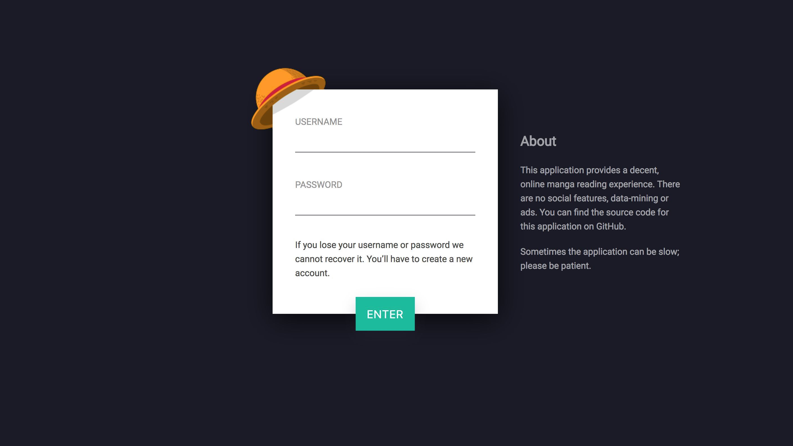
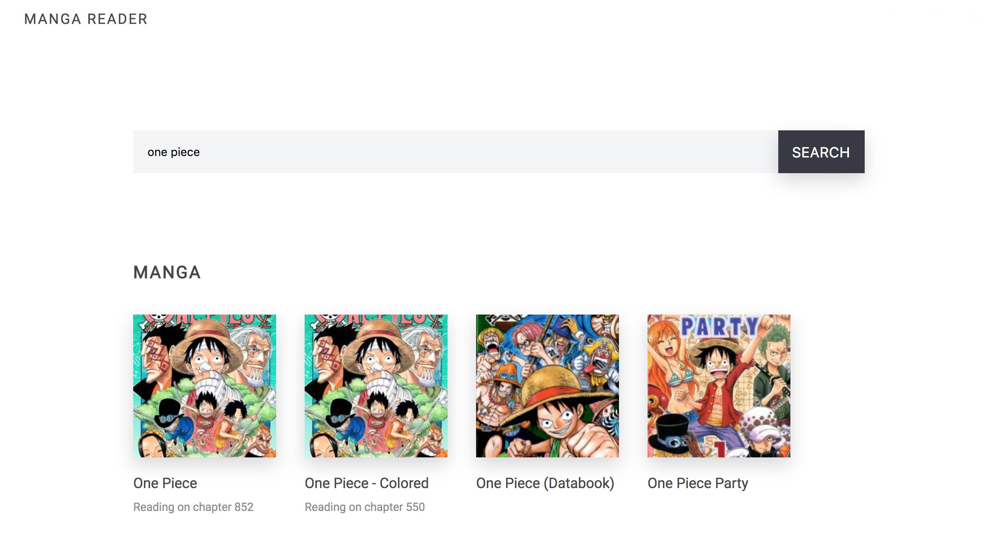

Banana
======

Banana is a self-hosted manga reader. It meets my expectations of what
a decent, online manga reader should look like. Most applications I've been
using over the years always fail to provide a good reading experience.

Banana is built with [Phoenix](http://www.phoenixframework.org/) and the
[Manga Scraper API](https://market.mashape.com/doodle/manga-scraper).

Development
-----------

### Application dependencies

Before anything else, make sure that you have the following installed:

* [Elixir](http://elixir-lang.org/install.html)
* [PostgreSQL](https://www.postgresql.org/download/)
* [NodeJS](https://nodejs.org/en/download/)

### Setup

To set up this application you need an account in [Mashape
marketplace](https://market.mashape.com/). Create your account and create an
application inside it. Add the [Manga Scraper
api](https://market.mashape.com/doodle/manga-scraper) to your application. Take
the application's test key and put it in `config/dev.secret.exs` (there is
sample file in the config folder). In production, the key will be read from the environment variable `MANGA_API_KEY`. See `config/prod.exs` for more details.

In development, the username and password for PostgreSQL will be read from the environment variables `DB_USERNAME` and `DB_PASSWORD`.

After, install the dependencies with `mix deps.get`. Create and migrate your database with `mix ecto.create && mix ecto.migrate`. Install node dependencies with `npm install`.

### Run

* Run the tests with `mix test`
* Start Phoenix endpoint with `mix phoenix.server`. Now you can visit [`localhost:4000`](http://localhost:4000) from your browser.

Production
----------

Basic auth is enabled in production. You need to define the environment
variables `AUTH_USERNAME` and `AUTH_PASSWORD`. You should also use the
production key from Mashape instead of the test key setup in development.
Finally, you need an environment variable `HOST` with your application's domain.

If you are going to use Heroku, just click the button:

Screenshots
-----------

